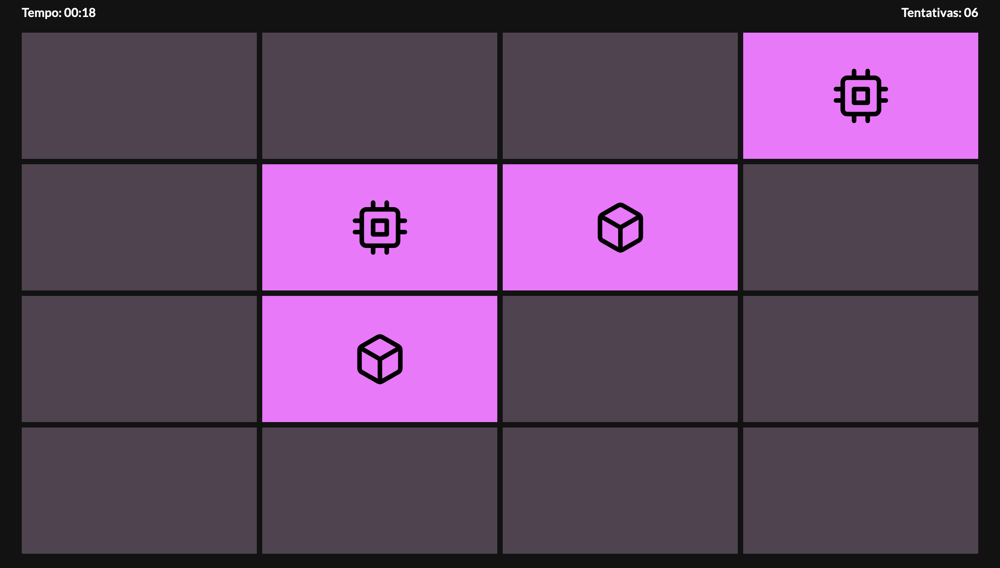

# Jogo da memória

## Tabela de conteúdos

- [Geral](#geral)
  - [Screenshot](#screenshot)
  - [Desenvolvido com](#desenvolvido-com)
  - [O que aprendi](#o-que-aprendi)
  - [Recursos úteis](#recursos-uteis)
- [Autor](#autor)

## Geral

Um site de jogo da memória. Nele, o usuário pode:
- Alterar a aparência do site para modo claro ou escuro
- Visualizar um cronômetro que marca o tempo de jogo
- Visualizar a quantidade de tentativas que ele fez
- Ao vencer, uma mensagem aparece informando o tempo e a quantidade de tentativas que ele precisou para ganhar
- Virar o card ao clicar, aparecendo o ícone
- Começar/pausar o cronômetro
- Reiniciar o jogo

### Screenshot

### Desenvolvido com

- HTML5
- TailwindCSS
- JavaScript

### O que aprendi

Durante esse projeto, aprendi as propriedades CSS 'transform-style', 'perspective', 'backface-visibility', como criar uma animação de girar um elemento, diferenças entre os métodos append() e appendChild() do JavaScript, opção safelist do TailwindCSS, como armazenar a preferência do usuário por tema (claro/escuro), algoritmo de Fisher-Yates para embaralhar os cards, entre outros tópicos.

### Recursos úteis

- [CSS: Aprenda a Criar o Efeito de Flip Cards](https://www.treinaweb.com.br/blog/css-aprenda-a-criar-o-efeito-de-flip-cards#:~:text=Podemos%20fazer%20esse%20efeito%20de,checkbox%20antes%20de%20flip%2Dcontainer%20.&text=E%20vamos%20mudar%20a%20regra%20que%20indica%20quando%20o%20elemento%20dever%C3%A1%20girar.)
- [How to randomize (shuffle) a JavaScript array?](https://stackoverflow.com/questions/2450954/how-to-randomize-shuffle-a-javascript-array?noredirect=1&lq=1)

## Autor

- GitHub - [marcelosarinho](https://github.com/marcelosarinho)
- LinkedIn - [Marcelo Sarinho](www.linkedin.com/in/marcelo-sarinho)
